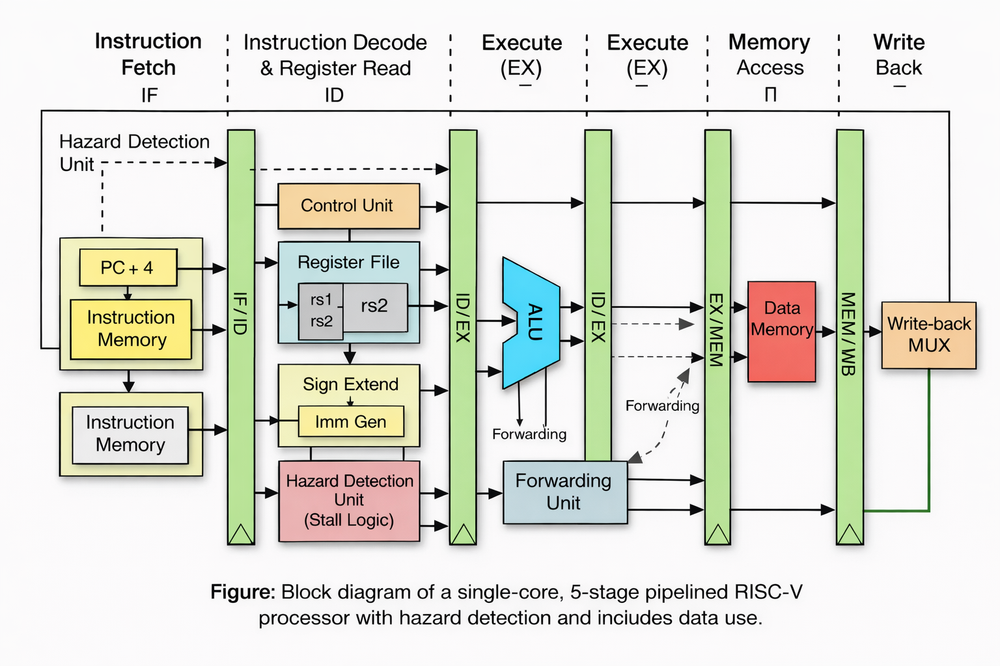

# Single-Core-5-Stage-Pipelined-RISC-V-Processor-with-Hazard-Handling-(RV32I)
This project presents the design and verification of a single-core, single-issue, 5-stage pipelined RISC-V (RV32I) processor developed as part of EL Phase-2 for the Computer Architecture course at RV College of Engineering Bengaluru.

The processor follows the classic five pipeline stages — Instruction Fetch (IF), Instruction Decode (ID), Execute (EX), Memory Access (MEM), and Write Back (WB) — and incorporates data hazard handling mechanisms to ensure correct execution of dependent instructions.
To improve performance and reduce pipeline stalls, the design includes:

- A hazard detection unit to identify load-use hazards

- A forwarding unit that resolves Read-After-Write (RAW) hazards by forwarding operands from later pipeline stages

- Controlled pipeline stalling and flushing when hazards cannot be resolved through forwarding

The processor supports a subset of the RV32I instruction set, including arithmetic, logical, load/store, and branch instructions. Functional correctness is verified using a self-checking Verilog testbench, which monitors pipeline activity, forwarding behavior, and final register values.

This implementation demonstrates fundamental concepts of pipelined processor design, hazard resolution, and verification, forming a strong foundation for further extensions such as branch prediction, cache integration, and advanced execution techniques.

## Block Diagram

The following figure shows the block diagram of the implemented single-core,
5-stage pipelined RISC-V processor with hazard handling.

Figure: Block diagram of a single-core, 5-stage pipelined RISC-V (RV32I) processor.
The architecture consists of IF, ID, EX, MEM, and WB stages with pipeline registers
and includes data hazard handling using operand forwarding and stall insertion.

Note: A common misconception - Although multiple functional blocks (ALU, branch logic, address calculation) are shown, they together form a single Execute (EX) stage and do not represent multiple pipeline stages :)
